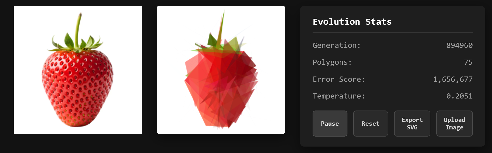
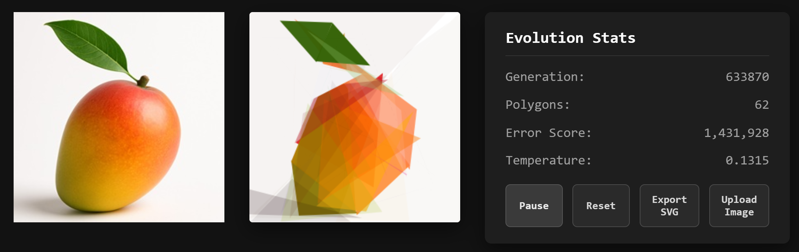

# Genetic Canvas Art

An interactive generative art simulator that evolves polygons to match a target image using a genetic algorithm and simulated annealing.

This project combines browser rendering, worker-based fitness scoring, and iterative mutation to recreate an image using geometric primitives.

## Gallery

[▶ Watch demo video](./assets/demo-video.mp4)





## Features

- Evolves translucent polygons toward a target image
- Uses simulated annealing to adjust mutation strength dynamically
- Starts with a small polygon count and adds complexity as the run plateaus
- Supports custom image upload from the browser
- Exports the current composition as SVG
- Displays generation count, polygon count, score, and temperature in real time

## Tech stack

- Language: TypeScript
- Rendering: HTML5 Canvas API
- Concurrency: Web Workers API
- Build tool: Vite
- Output format: SVG (Scalable Vector Graphics)

## Project structure

- `src/` — app logic, rendering, geometry, and worker code
- `public/` — static assets such as the default target image
- `index.html` — app entry point
- `package.json` — scripts and dependencies
- `README.md` — project overview and setup guide

## Getting started

### Prerequisites

- Node.js 18+
- npm

### Install dependencies

```bash
npm install
```

### Run locally

```bash
npm run dev
```

Then open the local Vite URL in your browser, typically:

```text
http://localhost:5173
```

## Build

```bash
npm run build
```

## Notes

- The default target image is served from `public/target.png`.
- You can upload a custom image from the app UI to evolve against a new reference image.
- Exported artwork is generated as SVG and can be opened in browsers or vector editors.
